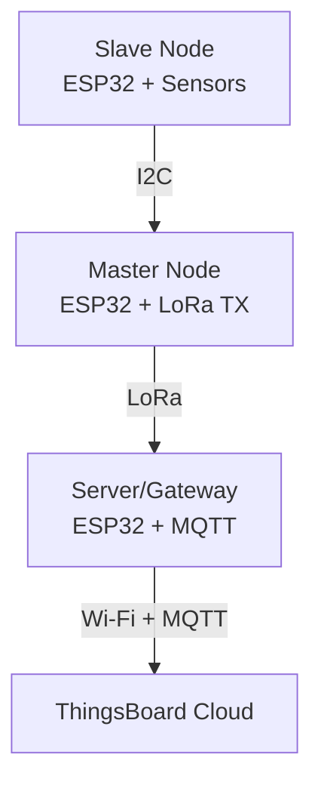

# Master_Thesis
## Development of an Energy-Adaptive Mobile Sensor Platform for Climate Monitoring in Controlled Environment Agriculture**

This repository contains three ESP32-based Arduino firmware that together implement a distributed wireless environmental monitoring system for Controlled Environment Agriculture (CEA).

The system consists of:

1. Slave Node (slave_normal.ino)
Reads environmental and soil-related sensor data.
2. Master Node (Master.ino)
Collects data from the slave node over I2C and transmits it using LoRa.
3. Server/Gateway Node (Server_final.ino)
Receives LoRa packets and uploads telemetry to a ThingsBoard MQTT server over Wi-Fi.

### System Architecture
# System Architecture

