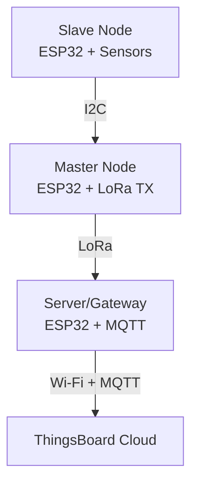

# Master_Thesis
## Development of an Energy-Adaptive Mobile Sensor Platform for Climate Monitoring in Controlled Environment Agriculture**

This repository contains three ESP32-based Arduino firmware that together implement a distributed wireless environmental monitoring system for Controlled Environment Agriculture (CEA).

The system consists of:

1. Slave Node (slave_normal.ino)
Reads environmental and soil-related sensor data.
2. Master Node (Master.ino)
Collects data from the slave node over I2C and transmits it using LoRa.
3. Server/Gateway Node (Server_final.ino)
Receives LoRa packets and uploads telemetry to a ThingsBoard MQTT server over Wi-Fi.

### System Architecture
# System Architecture

1. Slave Node — slave_normal.ino

The slave node is responsible for:

- Reading environmental sensor values
- Processing sensor data
- Sending formatted telemetry data to the master node through I2C

Connected Sensors:
| Sensor                 | Function                   |
| ---------------------- | -------------------------- |
| SCD30                  | CO₂, Temperature, Humidity |
| LDR                    | Light intensity            |
| Capacitive Soil Sensor | Soil moisture              |
| TDS Sensor             | Nutrient concentration     |

**Pin Configurations**

Sensor I2C Bus:
| Signal | GPIO |
| ------ | ---- |
| SDA    | 18   |
| SCL    | 19   |

Master Communication I2C:
| Signal | GPIO |
| ------ | ---- |
| SDA    | 21   |
| SCL    | 22   |

Analog Inputs:
| Sensor        | GPIO |
| ------------- | ---- |
| LDR           | 33   |
| Soil Moisture | 32   |
| TDS           | 35   |

Output Format - Example transmitted string::
CO2:512.4, Temp:24.8, Hum:56.2, LDR:1780, Soil:63.5, TDS:412.7

2. Master Node — Master.ino

The master node acts as an intermediate communication gateway between Slave sensor node & LoRa wireless network. It periodically requests sensor data over I2C and forwards it through LoRa.

**Pin Configurations**

I2C Communication:
| Signal | GPIO |
| ------ | ---- |
| SDA    | 21   |
| SCL    | 22   |

LoRa SPI Pins:
| Signal | GPIO |
| ------ | ---- |
| SCK    | 14   |
| MISO   | 12   |
| MOSI   | 13   |
| CS     | 15   |
| RESET  | 27   |
| IRQ    | 26   |

LoRa Configuration:
| Parameter | Value   |
| --------- | ------- |
| Frequency | 915 MHz |
| TX Power  | 13 dBm  |

**Workflow**
1. Request sensor data from slave node
2. Read incoming I2C string
3. Extract sensor values
4. Send telemetry packet via LoRa
5. Blink onboard LED after successful transmission

3. Server/Gateway Node — Server_final.ino

The gateway node receives LoRa packets and uploads telemetry data to a ThingsBoard server using secure MQTT over Wi-Fi.

**Features**
- LoRa packet reception
- Wi-Fi connectivity
- Secure MQTT communication (TLS)
- JSON telemetry generation
- ThingsBoard integration
- Automatic MQTT reconnection

Communication Flow:

LoRa Packet
    ↓
ESP32 Gateway
    ↓
Wi-Fi
    ↓
MQTT over TLS
    ↓
ThingsBoard Server

MQTT Configuration:

| Parameter     | Description                 |
| ------------- | --------------------------- |
| MQTT Server   | ThingsBoard broker          |
| Port          | 8883 (TLS)                  |
| Gateway Token | Device authentication token |
| Topic         | `v1/devices/me/telemetry`   |

**Required Libraries**

Install the following Arduino libraries before compiling.
- Wire
- SPI
- LoRa

Slave Node Libraries:
- SensirionI2cScd30

Gateway Node Libraries:
- WiFi
- WiFiClientSecure
- PubSubClient
- ArduinoJson

### Hardware Requirements
**Microcontrollers**
- 3 × ESP32 development boards

**Sensors**
- Sensirion SCD30 CO₂ sensor
- LDR module
- Capacitive soil moisture sensor
- TDS sensor

**Communication Modules**
- RFM95 LoRa modules

### Setup Instructions

Step 1 — Upload Firmware
| Device       | Firmware           |
| ------------ | ------------------ |
| Sensor Node  | `slave_normal.ino` |
| Master Node  | `Master.ino`       |
| Gateway Node | `Server_final.ino` |

Step 2 — Configure Wi-Fi
Edit Wi-Fi credentials in Server_final.ino.

Step 3 — Configure MQTT
Update if required:

- MQTT server
- Device token
- Telemetry topic

Step 4 — Power the Devices
Power all ESP32 boards using:

- USB
- Battery/Power Bank
- External regulated supply

**Applications**
- Smart greenhouse monitoring
- Hydroponics
- Precision agriculture
- Distributed environmental sensing
- Wireless sensor networks

